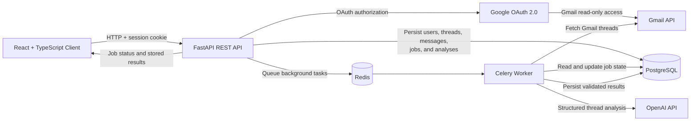

# Inbox2Done

**Inbox2Done is an asynchronous AI email workflow platform that converts Gmail threads into structured, actionable information.**

The system connects to Gmail through Google OAuth 2.0, synchronizes email threads into PostgreSQL, dispatches long-running work through Celery and Redis, and uses an LLM analysis pipeline to generate summaries, action items, deadlines, and suggested replies.

The project is designed around backend reliability concerns including asynchronous execution, persistent job state, duplicate-work prevention, structured API errors, schema validation, and testable external-service boundaries.

> **Current status:** The backend, Gmail synchronization pipeline, background-job infrastructure, and AI analysis services are implemented. Frontend integration, full application containerization, CI/CD, and Kubernetes deployment are in progress.

---

## Architecture



### Request lifecycle

1. A user connects a Google account through OAuth 2.0.
2. Inbox2Done stores the user identity and OAuth credentials.
3. The API creates a persistent background-job record.
4. A Celery task is submitted through Redis.
5. The worker synchronizes Gmail threads and messages into PostgreSQL.
6. Duplicate provider IDs and active-job checks prevent repeated work.
7. A thread-analysis request is queued asynchronously.
8. The AI service returns structured summaries, action items, deadlines, and suggested replies.
9. Validated results are persisted and retrieved through the API.

---

## Engineering Focus

Inbox2Done is more than a direct wrapper around an LLM API. The backend is structured around several systems-engineering concerns.

### Asynchronous execution

Gmail synchronization and AI analysis are submitted as background jobs instead of blocking API requests. The API returns a job identifier that clients can poll for status and results.

### Persistent job state

Background-job records are stored in PostgreSQL so work can be inspected independently of the Celery process that executes it.

Job states include:

* `queued`
* `running`
* `completed`
* `failed`

### Duplicate-work prevention

The application prevents duplicate processing through:

* Gmail provider-ID uniqueness constraints
* Indexed database lookups
* Existing active-job checks
* Idempotent thread and message persistence
* Optional forced thread reanalysis

### Structured AI outputs

LLM responses are parsed into typed schemas instead of being accepted as unrestricted text. The analysis layer validates expected fields before persisting results.

### Failure visibility

External-service, database, authentication, validation, and missing-resource failures are translated into structured API errors rather than leaking internal exceptions.

### Health analysis

The health endpoint verifies both application availability and PostgreSQL connectivity.

---

## Implemented Capabilities

### Authentication and Gmail

* Google OAuth 2.0 login and callback flow
* Session-based authentication
* Gmail read-only authorization scope
* User and OAuth-token persistence
* Google connection-status endpoint
* Background Gmail synchronization
* Configurable synchronization limits
* Duplicate active-sync protection
* Gmail thread and message normalization
* Provider-ID deduplication

### Email persistence

* PostgreSQL-backed user records
* Email-thread storage
* Individual email-message storage
* Thread-to-message relationships
* Gmail message-ID uniqueness
* Indexed lookup fields
* Alembic database migrations
* Paginated thread retrieval
* Thread-detail retrieval with messages

### Background processing

* Celery worker configuration
* Redis task broker
* Redis result backend
* Persistent background-job records
* Task identifiers
* Job progress and status tracking
* Late task acknowledgements
* Worker prefetch control
* Hard and soft task time limits
* Duplicate active-job protection
* Job-status API

### AI analysis

* Configurable OpenAI model
* Structured thread-analysis prompts
* Typed response validation
* Thread summaries
* Priority and category extraction
* Action-item extraction
* Deadline extraction
* Suggested-reply generation
* Persistent analysis records
* Forced reanalysis support
* Malformed-output handling

### API quality

* FastAPI and Pydantic schemas
* OpenAPI documentation
* Paginated REST responses
* Structured application errors
* Database-backed health check
* CORS configuration
* Session middleware
* Development and production configuration separation

### Testing

The backend test suite covers core behavior including:

* Health checks
* Thread pagination
* Thread-detail retrieval
* Email-message persistence
* Gmail synchronization
* Authentication behavior
* Google OAuth persistence
* Analysis models
* Thread-analysis services

---

## Technology Stack

### Backend

* Python 3.11+
* FastAPI
* Pydantic
* SQLAlchemy 2
* PostgreSQL
* Alembic
* Celery
* Redis
* OpenAI API
* Google OAuth 2.0
* Gmail API

### Frontend

* React
* TypeScript
* Vite
* Mantine

### Infrastructure and quality

* Docker Compose
* pytest
* pytest-asyncio
* Ruff
* Git
* GitHub

---

## Repository Structure

```text
Inbox2Done/
├── backend/
│   ├── alembic/                 # Database migration revisions
│   ├── app/
│   │   ├── api/                 # FastAPI route handlers
│   │   │   ├── auth.py
│   │   │   ├── gmail.py
│   │   │   ├── health.py
│   │   │   ├── jobs.py
│   │   │   └── threads.py
│   │   ├── core/                # Configuration and error handling
│   │   ├── db/                  # SQLAlchemy engine, sessions, and base model
│   │   ├── models/              # Persistent database models
│   │   ├── schemas/             # Request and response schemas
│   │   ├── services/            # Gmail, OAuth, and AI business logic
│   │   ├── worker/
│   │   │   ├── tasks/           # Celery task implementations
│   │   │   └── celery_app.py
│   │   └── main.py              # FastAPI application entry point
│   ├── scripts/                 # Development and verification scripts
│   ├── tests/                   # Backend test suite
│   ├── .env.example
│   ├── alembic.ini
│   └── pyproject.toml
├── client/
│   ├── public/
│   ├── src/
│   └── package.json
├── docker-compose.yml           # PostgreSQL and Redis development services
├── LICENSE
└── README.md
```

---

## Prerequisites

Install the following before running the project:

* Python 3.11 or newer
* Node.js 20 or newer
* Docker Desktop
* Git
* A Google Cloud OAuth client
* An OpenAI API key

---

## Local Development

### 1. Clone the repository

```bash
git clone https://github.com/lucasbassem/Inbox2Done.git
cd Inbox2Done
```

### 2. Start PostgreSQL and Redis

The current Docker Compose configuration provisions PostgreSQL and Redis for local development.

```bash
docker compose up -d
```

Verify that both services are healthy:

```bash
docker compose ps
```

Expected services:

```text
inbox2done-postgres
inbox2done-redis
```

### 3. Create the backend environment

#### Windows PowerShell

```powershell
cd backend

py -3.11 -m venv .venv
.\.venv\Scripts\Activate.ps1

python -m pip install --upgrade pip
pip install -e ".[dev]"

Copy-Item .env.example .env
```

#### macOS or Linux

```bash
cd backend

python3.11 -m venv .venv
source .venv/bin/activate

python -m pip install --upgrade pip
pip install -e ".[dev]"

cp .env.example .env
```

Update `backend/.env` with your local credentials and secrets.

Never commit the completed `.env` file.

### 4. Apply database migrations

From the `backend` directory:

```bash
alembic upgrade head
```

To inspect the current migration:

```bash
alembic current
```

### 5. Start the FastAPI server

```bash
uvicorn app.main:app --reload
```

The API will be available at:

```text
http://127.0.0.1:8000
```

Interactive API documentation:

```text
http://127.0.0.1:8000/docs
```

Alternative ReDoc documentation:

```text
http://127.0.0.1:8000/redoc
```

### 6. Start the Celery worker

Open a second terminal, activate the backend virtual environment, and remain inside `backend/`.

#### Windows

```powershell
celery -A app.worker.celery_app:celery_app worker `
  --loglevel=INFO `
  --pool=solo
```

The `solo` pool is recommended for local Celery development on Windows.

#### macOS or Linux

```bash
celery -A app.worker.celery_app:celery_app worker \
  --loglevel=INFO
```

### 7. Start the frontend

Open another terminal:

```bash
cd client
npm install
npm run dev
```

The frontend development server will be available at:

```text
http://localhost:5173
```

> The frontend interface exists, but complete integration with the current FastAPI API is still in progress.

---

## Google OAuth Configuration

### 1. Create a Google Cloud project

In Google Cloud Console:

1. Create or select a project.
2. Enable the Gmail API.
3. Configure the OAuth consent screen.
4. Create an OAuth 2.0 Client ID for a web application.

### 2. Add the authorized redirect URI

Use:

```text
http://127.0.0.1:8000/api/auth/google/callback
```

The redirect URI must exactly match `GOOGLE_REDIRECT_URI`.

### 3. Configure credentials

Set these values in `backend/.env`:

```env
GOOGLE_CLIENT_ID=your-google-client-id
GOOGLE_CLIENT_SECRET=your-google-client-secret
GOOGLE_REDIRECT_URI=http://127.0.0.1:8000/api/auth/google/callback
```

### 4. Connect a Google account

Start the API, then open:

```text
http://127.0.0.1:8000/api/auth/google/login
```

After authorization, Google redirects to the callback endpoint, which:

* Validates the OAuth response
* Creates or updates the user
* Stores the access and refresh credentials
* Creates the authenticated application session

The application requests Gmail read-only access. It does not request permission to send, delete, modify, or mark email.

---

## Core API Endpoints

| Method | Endpoint                           | Purpose                                    |
| ------ | ---------------------------------- | ------------------------------------------ |
| `GET`  | `/health`                          | Check API and database health              |
| `GET`  | `/api/auth/google/login`           | Begin Google OAuth authorization           |
| `GET`  | `/api/auth/google/callback`        | Complete Google OAuth authorization        |
| `GET`  | `/api/auth/google/status`          | Read Google connection status              |
| `POST` | `/api/gmail/sync`                  | Queue a Gmail synchronization job          |
| `GET`  | `/api/jobs/{job_id}`               | Retrieve persistent background-job state   |
| `GET`  | `/api/threads`                     | Retrieve a paginated list of email threads |
| `GET`  | `/api/threads/{thread_id}`         | Retrieve a thread and its messages         |
| `POST` | `/api/threads/{thread_id}/analyze` | Queue asynchronous AI analysis             |

The generated OpenAPI schema at `/docs` is the authoritative reference for request parameters and response bodies.

---

## Background Job Examples

### Queue Gmail synchronization

After connecting a Google account, submit:

```http
POST /api/gmail/sync?max_threads=10
```

Successful submission returns HTTP `202 Accepted`:

```json
{
  "job_id": 4,
  "task_id": "75b35bde-47fa-4a86-a970-9bd21cb37b57",
  "status": "queued"
}
```

Only one active Gmail synchronization job is permitted per user. A second request while a job is queued or running returns a structured conflict response.

### Queue thread analysis

```http
POST /api/threads/1/analyze
```

Force a new analysis even when a completed analysis already exists:

```http
POST /api/threads/1/analyze?force=true
```

Successful submission returns HTTP `202 Accepted`:

```json
{
  "job_id": 5,
  "task_id": "e1190d4b-757a-43d5-8e4c-4317ab1d2067",
  "status": "queued"
}
```

### Poll job state

```http
GET /api/jobs/5
```

The job record provides durable status independent of the HTTP request that originally submitted the work.

---

## Health Check

Request:

```http
GET /health
```

Healthy response:

```json
{
  "status": "ok",
  "service": "inbox2done-api",
  "database": "connected",
  "timestamp": "2026-08-05T19:00:00Z"
}
```

If the API process is running but PostgreSQL is unavailable, the endpoint reports:

```json
{
  "status": "degraded",
  "service": "inbox2done-api",
  "database": "disconnected",
  "timestamp": "2026-08-05T19:00:00Z"
}
```

---

## Testing

From the `backend` directory with the virtual environment active:

```bash
pytest
```

Run a specific module:

```bash
pytest tests/test_gmail_sync.py
```

Run a specific test:

```bash
pytest tests/test_thread.py::test_get_thread
```

Run lint checks:

```bash
ruff check .
```

Check formatting:

```bash
ruff format --check .
```

Apply automatic formatting:

```bash
ruff format .
```

---

## Database Migrations

Create a migration after changing SQLAlchemy models:

```bash
alembic revision --autogenerate -m "describe schema change"
```

Review the generated migration before applying it.

Apply all migrations:

```bash
alembic upgrade head
```

Roll back one migration:

```bash
alembic downgrade -1
```

Inspect migration history:

```bash
alembic history
```

---

## Data Model

Core persistent entities include:

* `users`
* `oauth_tokens`
* `email_threads`
* `email_messages`
* `background_jobs`
* `thread_analyses`
* `action_items`
* `suggested_replies`

The database design separates raw synchronized email data from derived AI analysis so analyses can be regenerated without duplicating source messages.

---

## Reliability Design

### Idempotent Gmail persistence

Gmail provider identifiers are treated as stable external identities. Existing threads and messages are updated or reused instead of blindly inserted again.

### Duplicate active-job protection

Before queueing synchronization, the API checks for an existing job in `queued` or `running` state.

### Late task acknowledgement

Celery acknowledges work after task execution, reducing the chance that a worker crash silently loses an accepted task.

### Worker time limits

Celery tasks have soft and hard execution limits to prevent indefinitely stuck work.

### Controlled prefetching

The worker prefetch multiplier is limited so one worker does not reserve excessive queued work.

### Structured validation

API and AI outputs pass through Pydantic schemas before being returned or persisted.

### Persistent results

Analysis outputs are stored in normalized database tables rather than existing only in process memory or a Celery result backend.

---

## Security Notes

This repository is currently intended for development and portfolio demonstration.

Implemented protections include:

* Gmail read-only OAuth scope
* Session-based access control
* SameSite session cookies
* HTTPS-only session cookies in production mode
* Environment-based secret configuration
* CORS origin restrictions
* User-scoped background-job retrieval
* Structured errors without stack-trace responses

Before a production deployment, the following work is still required:

* Encrypt OAuth credentials at rest
* Store production secrets in a managed secret system
* Add token revocation and account-disconnect behavior
* Add CSRF review for state-changing browser requests
* Enforce production HTTPS
* Add rate limiting
* Add centralized audit logging
* Add stricter multi-user authorization checks
* Complete a dependency and secret-history audit

Never commit:

* `.env`
* Google client secrets
* OpenAI API keys
* Access tokens
* Refresh tokens
* Production database credentials

---

## Current Limitations

* The React frontend is not yet fully connected to every FastAPI endpoint.
* Docker Compose currently provisions PostgreSQL and Redis, not the full application stack.
* Kubernetes manifests have not yet been added.
* OAuth-token encryption at rest is not yet implemented.
* Production monitoring and alerting are not yet implemented.
* Outlook and Microsoft Graph integration are not currently implemented.
* The application has not yet been deployed as a public production service.

These limitations are documented intentionally so the repository distinguishes implemented functionality from planned work.

---

## Roadmap

### Application integration

* Connect the React client to the FastAPI thread and job APIs
* Add authenticated Gmail connection and synchronization controls
* Display queued, running, completed, and failed job states
* Display summaries, action items, deadlines, and suggested replies
* Add job polling and retry behavior
* Add frontend tests with Vitest and React Testing Library

### Reliability

* Add reusable retry policies for Gmail and OpenAI calls
* Add request IDs and structured JSON logging
* Add transient-failure classification
* Add explicit external-service timeouts
* Add failure-recovery tests
* Add metrics for queue depth, task duration, and failures

### Containers and deployment

* Add a backend Dockerfile
* Add a Celery-worker container
* Add a frontend Dockerfile
* Expand Docker Compose to run the complete stack
* Add container health checks
* Add Kubernetes deployments and services
* Add readiness and liveness probes
* Add resource requests and limits
* Support independent API and worker scaling

### Delivery

* Add GitHub Actions for Ruff, pytest, frontend tests, and builds
* Add Docker build validation
* Add deployment configuration
* Publish an initial tagged release
* Add architecture and deployment documentation

---

## Project Goals

Inbox2Done is being developed to demonstrate practical engineering across:

* REST API design
* OAuth 2.0 integration
* External API synchronization
* Relational data modeling
* Background-job orchestration
* Asynchronous AI workflows
* Idempotency and deduplication
* Failure handling
* Schema validation
* Automated testing
* Containerized infrastructure
* Production-readiness planning

---

## License

This project is licensed under the MIT License. See [`LICENSE`](LICENSE) for details.
