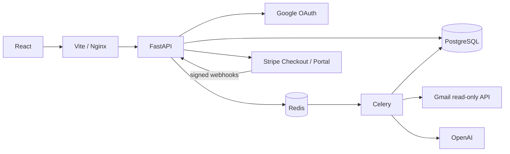

# Inbox2Done

Load today’s Primary inbox, then click **Analyze today’s inbox** for summaries, action items, deadlines, and suggested replies.

The React application connects to the FastAPI backend through a same-origin proxy. Gmail sync and AI analysis run in Celery workers, with durable job records and results in PostgreSQL. Redis handles the queue. Stripe manages optional Pro subscriptions.

## What works

- Google sign-in, session cookies, OAuth callback back to the app, and sign-out.
- Opening the app fetches all of today’s Primary inbox messages, using the browser’s local time zone and daylight-saving boundaries. It follows Gmail pagination and excludes older messages within matching conversations.
- **Analyze today’s inbox** explicitly starts a batch for today. Loading, refreshing, and the midnight rollover never request AI analysis. Unchanged messages reuse saved analyses; partial failures can be retried.
- Existing stored mail is retained, while the Today screen shows only the current day. No background schedule runs when the app is closed.
- Queued analysis, automatic job polling, retry controls, and job history that survives reloads.
- Structured summaries, priority, actions, owners, deadlines, and suggested replies.
- Persistent task completion/reopening and copy-to-clipboard replies. The app never sends email.
- User-owned threads, analyses, tasks, jobs, and billing data; cross-origin browser writes are rejected.
- The Today batch processes the whole day without the legacy per-thread daily allowance. The legacy manual thread API retains its Free/Pro limits.
- Stripe Checkout, signed/idempotent subscription webhooks, and customer billing portal.
- Optional encrypted OAuth credentials in development; mandatory encryption, strong sessions, and HTTPS in production.
- Full Docker Compose stack, local kind manifests including the web client, and GitHub Actions verification.

## Start the complete application

Prerequisites: Docker Desktop with a working Linux engine; a Google OAuth web client; an OpenAI API key. Stripe is optional.

```powershell
Copy-Item .env.docker.example .env.docker
# Edit .env.docker locally. Never commit secrets.
docker compose --env-file .env.docker up -d --build --wait
```

Open **http://localhost:8080** and connect Google. Today’s Primary inbox loads automatically. Click **Analyze today’s inbox** to analyze the day, check off tasks, and copy replies. **Refresh today** checks Gmail without requesting AI analysis. The displayed local time zone defines today, from midnight to midnight.

In `.env.docker`, configure:

| Setting | Value |
| --- | --- |
| `GOOGLE_CLIENT_ID`, `GOOGLE_CLIENT_SECRET` | Your Google web OAuth credentials |
| `GOOGLE_REDIRECT_URI` | `http://localhost:8080/api/auth/google/callback` |
| `FRONTEND_ORIGIN` | `http://localhost:8080` |
| `OPENAI_API_KEY` | Your API key |
| `OPENAI_MODEL` | A model your OpenAI account can use for structured responses |
| `SESSION_SECRET_KEY` | A long random secret shared by API instances |
| `TOKEN_ENCRYPTION_KEY` | Optional Fernet key for development; required for production |

Enable the Gmail API in Google Cloud. Add the exact redirect URI to the OAuth client and add your Google account as a test user while the consent screen is in testing. Use `localhost` consistently; mixing it with `127.0.0.1` breaks cookie/OAuth continuity.

Compose runs `web`, `api`, `worker`, `migrate`, `postgres`, and `redis`. Local ports bind to loopback. PostgreSQL and Redis data persist in named volumes; `docker compose down` stops the app without deleting them. Do not use `down -v` unless intentionally erasing local data.

```powershell
docker compose --env-file .env.docker ps
docker compose --env-file .env.docker logs api worker migrate
Invoke-RestMethod http://localhost:8080/health/ready
docker compose --env-file .env.docker up -d --scale worker=3
```

Changing the PostgreSQL password in the environment does not change a password inside an existing database volume. Use a proper database credential migration rather than deleting data.

## Development without application containers

Start only PostgreSQL and Redis:

```powershell
Copy-Item .env.docker.example .env.docker
docker compose --env-file .env.docker up -d postgres redis
cd backend
py -3.12 -m venv .venv
.\.venv\Scripts\Activate.ps1
pip install -e ".[dev]"
Copy-Item .env.example .env
# Configure credentials and the localhost database connection in backend/.env.
alembic upgrade head
uvicorn app.main:app --reload
```

In a second terminal, activate the same virtual environment and run:

```powershell
celery -A app.worker.celery_app:celery_app worker --loglevel=INFO --pool=solo
```

In a third terminal:

```powershell
cd client
npm ci
npm run dev
```

Open **http://localhost:5173**. For this mode use `FRONTEND_ORIGIN=http://localhost:5173` and register `http://localhost:5173/api/auth/google/callback` in Google Cloud and `backend/.env`. Vite proxies `/api` to port 8000, so the frontend does not need a separate API URL. Existing `VITE_API_BASE_URL` settings are no longer used.

## Billing

The free plan works without Stripe. To enable upgrades, set `STRIPE_SECRET_KEY`, `STRIPE_PRO_PRICE_ID` (a recurring price), and `STRIPE_WEBHOOK_SECRET`. Checkout is hidden until all three are configured. Prices and payment confirmation are shown in Stripe Checkout; no payment is triggered by loading the dashboard.

For local **test-mode** billing:

```powershell
stripe listen --forward-to localhost:8080/api/billing/webhook
```

Set the listener's signing secret locally and restart the API. Subscribe to snapshot events:

- `checkout.session.completed`
- `customer.subscription.created`
- `customer.subscription.updated`
- `customer.subscription.deleted`

Enable the customer portal in Stripe Dashboard. The application uses that portal for payment methods and subscription cancellation. Only verified webhooks update the plan; a `checkout=success` URL cannot grant Pro. Subscription state is retrieved from Stripe to handle delayed event delivery. Use test keys/cards for manual billing tests.

Usage is reserved when a job is accepted, with account-level locking in PostgreSQL. Duplicate queued jobs do not consume another use; queue and worker failures refund that job's reservation. Hard worker termination can still require operator recovery of a stuck job; this is not an exactly-once queue.

## Verification

```powershell
cd backend
pytest
ruff check .
ruff format --check .
alembic heads
cd ../client
npm test
npm run lint
npm run build
npx playwright install chromium
npm run test:e2e
```

Backend tests cover service behavior, multi-user access, token encryption, quota accounting, queue failure, OAuth redirect/logout, Stripe signatures, duplicate webhooks, cancellation, and customer ownership. React tests cover normal/error/loading states. The Playwright workflow exercises sync → analysis → completion → reload → reopen → copy → sign-out, including desktop/mobile screenshots, using deterministic mocked provider/API responses.

GitHub Actions additionally builds and starts the real Compose stack and checks readiness and worker connectivity. Automated mocks do **not** prove that a particular Google/OpenAI/Stripe account is configured correctly; live provider checks require your local credentials and consent.

## API

Interactive documentation: `http://localhost:8000/docs`.

| Method | Path | Purpose |
| --- | --- | --- |
| GET | `/api/auth/google/login`, `/callback`, `/status` | Google sign-in and connection |
| POST | `/api/auth/google/logout` | Clear browser session |
| POST | `/api/today?time_zone=America/New_York&analyze=false` | Fetch today; `analyze=true` explicitly requests AI analysis |
| GET | `/api/threads`, `/api/threads/{id}` | Current user's conversations |
| POST | `/api/gmail/sync?max_threads=20` | Queue Gmail sync |
| POST | `/api/threads/{id}/analyze?force=false` | Queue analysis; reuse unchanged results |
| GET | `/api/threads/{id}/analysis` | Stored analysis |
| PATCH | `/api/actions/{id}` | Update task status/priority/owner/deadline |
| GET | `/api/jobs`, `/api/jobs/{id}` | Recent jobs and job status |
| GET | `/api/billing/status` | Plan and remaining daily usage |
| POST | `/api/billing/checkout`, `/portal`, `/webhook` | Stripe integration |
| GET | `/health/live`, `/health/ready` | Process and database health |

## Deployments and security

See [k8s/README.md](k8s/README.md) for the existing local kind deployment and web port-forwarding. It is a development deployment, not a hosted production service.

To generate keys with the backend environment active:

```powershell
python -c "import secrets; print(secrets.token_urlsafe(48))"
python -c "from cryptography.fernet import Fernet; print(Fernet.generate_key().decode())"
```

Keep the encryption key in a secret manager and preserve it alongside backups. If credentials already exist in plaintext, back up the database, configure `TOKEN_ENCRYPTION_KEY`, then run `python -m scripts.encrypt_oauth_tokens` before switching to production. The command encrypts existing records transactionally without printing token values. Do not replace a key while encrypted rows still depend on it.

`APP_ENV=production` refuses insecure session keys, missing encryption keys, or HTTP frontend/OAuth URLs. Production still needs TLS/ingress, managed secrets, database backups, monitoring, an OAuth consent verification/privacy process, and infrastructure-level abuse controls. Email text is stored locally in the database and sent to OpenAI when analysis is requested. Replies remain drafts. Sign-out clears the session, not stored mail; revoke Google access through your Google account if needed.

The optional `extension/` is a lightweight Gmail launcher for the app. It does not scrape messages or call the removed legacy port-4000 endpoints. Set its destination in `extension/content.js` for another deployment.

## Architecture


```mermaid
flowchart LR
  Browser[React] --> Web[Vite / Nginx]
  Web --> API[FastAPI]
  API --> Google[Google OAuth]
  API --> DB[(PostgreSQL)]
  API --> Redis[(Redis)]
  Redis --> Worker[Celery]
  Worker --> Gmail[Gmail read-only API]
  Worker --> AI[OpenAI]
  Worker --> DB
  API --> Stripe[Stripe Checkout / Portal]
  Stripe -->|signed webhooks| API
```

MIT License. See [LICENSE](LICENSE).
